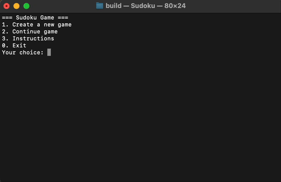

# Terminal Sudoku Game in C

This is a terminal-based implementation of the classic Sudoku game written in C. The game supports different board sizes and difficulty levels, a lives system, saving/loading functionality, and a simple text-based UI.

---

## Features

- Choose board size: `4x4`, `9x9`, or `16x16`
- Three difficulty levels: `Easy`, `Medium`, `Hard`
- 5-life system – wrong moves reduce lives
- Save and load game state to/from `autosave.sav`
- Timer showing how long it took to solve the board
- Simple, clean interface for terminal

---

## Gameplay

---

## How to Play

- Select a board size and difficulty at launch.
- During the game, you input moves in the format:

  **row column number**

  For example:

  **2 3 9**

- To access in-game options (save or exit), enter `0` as the row.
- Fill the entire board correctly to win. If you make 5 wrong moves, the game ends.

---

## Meme

